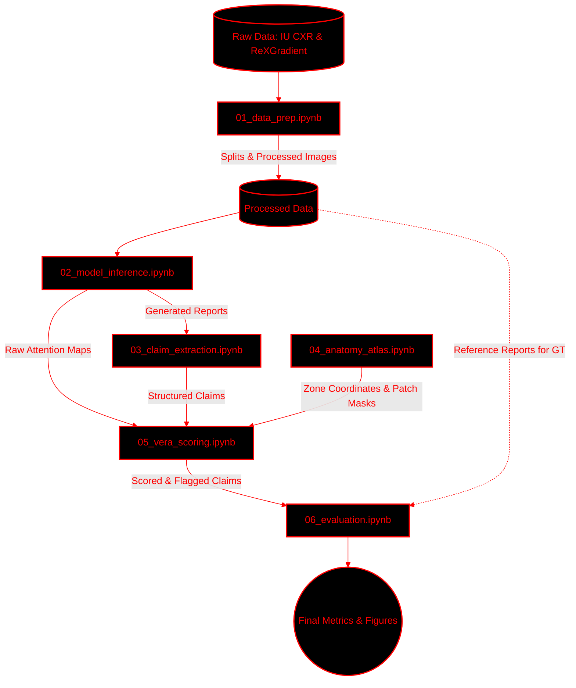

# VERA: Visual Evidence–Report Alignment for Hallucination Detection in Clinical AI

VERA is a fully automated, self-contained post-generation auditing system designed to detect and flag hallucinations in radiology reports generated by vision-language models (VLMs). 

When clinical AI models generate medical reports, they frequently produce "hallucinated" findings—anatomical claims that are not supported by the patient's actual scan. VERA addresses this critical safety risk by analyzing the model's internal cross-attention mechanisms during the generation process to verify if the model was actually "looking" at the correct anatomical region when making a clinical claim.

Unlike existing approaches, VERA operates entirely **zero-shot**—it requires no hallucination-labelled training data or external reference databases.

---

## Table of Contents
1. [Core Problem & Solution](#core-problem--solution)
2. [Supported Datasets & Models](#supported-datasets--models)
3. [Key Features](#key-features)
4. [System Architecture](#system-architecture)
5. [Data Flow & Execution Pipeline](#data-flow--execution-pipeline)
6. [Repository Structure](#repository-structure)

---

## Core Problem & Solution

### The Challenge
Large VLMs (like LLaVA-Med or CheXagent) are prone to generating fluent but clinically inaccurate text. A model might state *"There is opacity in the right lower lobe,"* even if the input X-Ray is perfectly clear. Detecting this post-generation typically requires human experts or massive LLMs cross-referencing external databases, which is expensive and unscalable.

### The VERA Solution
VERA assumes that a trustworthy VLM must attend to the correct visual features when making a claim. If a model claims there is a "pneumothorax in the left apex," its cross-attention maps for those specific text tokens should heavily activate the top-left region of the image. If the attention is diffuse or focused elsewhere, VERA flags the claim as an **anatomical hallucination**.

---

## Supported Datasets & Models

The repository is configured to handle multiple data sources and models seamlessly, with automatic path detection optimized for **Kaggle** environments.

### Datasets Evaluated
* **Indiana University Chest X-Rays (IU CXR)**: 
  * Consists of ~7,470 frontal CXR images with paired, highly structured radiologist reports (findings and impression). 
  * Easily accessible via Kaggle mount (`/kaggle/input/chest-xrays-indiana-university/`). 
  * Ground truth for hallucination evaluation is generated dynamically via token-level NLI comparing model generation against these reference reports.
* **ReXGradient-160K**: 
  * A large-scale gated dataset on HuggingFace (`rajpurkarlab/ReXGradient-160K`). 
  * We bypass full downloads by leveraging the HuggingFace `datasets` streaming API to extract a specific 500-sample subset directly into the pipeline.
* **MIMIC-CXR**: 
  * The gold standard benchmark consisting of 227,827 images and 227,835 reports from Beth Israel Deaconess Medical Center. 
  * Compatible format (requires PhysioNet credentialing). Includes structured CheXpert labels.

### Supported Vision-Language Models (VLMs)
* **CheXagent-2-3b** (`StanfordAIMI/CheXagent-2-3b`) - **Recommended**. 
  * Stanford's model trained specifically on chest X-rays and radiology reports. 
  * Domain-specific training yields significantly more interpretable cross-attention maps for medical imaging, making it an ideal candidate for VERA alignment scoring.
* **LLaVA-Med** (`microsoft/llava-med-v1.5-mistral-7b`) 
  * A powerful general-purpose biomedical adaptation of the LLaVA architecture.
* **NLI Evaluator**
  * For testing and evaluation, we utilize an underlying biomedical NLI model to construct ground-truth evaluation labels by scoring generated text entailment against radiologist references.

---

## Key Features

* **Zero-Shot Auditing:** Does not require finetuning or ground-truth hallucination labels.
* **Post-Hoc Verification:** Hooks into existing VLMs during inference without altering their architecture.
* **Severity-Calibrated:** Adapts strictness based on clinical risk (e.g., highly strict for "tumors", moderately strict for "mild infiltrates").
* **Fully Interpretable:** Outputs exact attention heatmaps and parsed bounding boxes for clinical review.

---

## System Architecture

VERA evaluates generated radiology reports through a highly structured, three-stage pipeline.

### 1. Clinical Claim Extraction
Before checking an image, VERA must understand the text.
* **Process**: The system processes the raw generated text using a specialized radiology NLP pipeline built on `scispaCy`.
* **Output**: Extracts structured clinical claims, isolating the specific finding, its anatomical location, and the severity/negation status.
* **Example**: The text *"There is opacity in the right lower lobe"* is parsed into `{ finding: "opacity", location: "right lower lobe" }`.

### 2. Anatomical Atlas Localisation
Once the text is structured, VERA maps it to the visual space.
* **Process**: VERA maps the extracted anatomical text locations to precise pixel-level regions on the original input image.
* **Mechanism**: Utilizes a predefined 13-zone chest anatomy atlas (including the *right upper lobe, left lower lobe, mediastinum, hilum, costophrenic angles*) to generate exact bounding boxes and patch-grid masks matching the VLM's vision encoder.

### 3. Cross-Attention Alignment Scoring
The final verification step links the text, the visual space, and the model's internal state.
* **Process**: Computes the VERA alignment score by measuring the density of the VLM's cross-attention within the localized anatomical region during the generation of the claim's specific tokens.
* **Severity Thresholds**: The claim is flagged as a hallucination if the computed score falls below a dynamically calibrated threshold based on clinical severity. Critical claims (e.g., pneumothorax) require a much higher threshold of attention focus (e.g., `0.35`) compared to mild claims (e.g., `0.15`).

---

## Data Flow & Execution Pipeline

The codebase is organized into sequential Jupyter Notebooks that handle the end-to-end pipeline from data preparation to final metric calculation.

### System Diagram



### Notebook Execution Guide

You can run VERA either step-by-step locally or end-to-end on Google Colab.

#### Option 1: Google Colab (Recommended for GPU constraints)
* **`VERA_Colab_Pipeline.ipynb`**: A unified, single-notebook pipeline designed specifically for Colab's T4 GPU. It handles Kaggle credentials, dependency patching (bypassing Colab library conflicts), automated memory management, and runs Phases 1 through 6 sequentially.

#### Option 2: Step-by-Step Local Execution
* **Phase 1: Preparation**
  * `01_data_prep.ipynb`: Loads and parses datasets, generating standard splits.
* **Phase 2: Generation & Hooking (GPU Required)**
  * `02_model_inference.ipynb`: Initializes the VLM, registers hooks, and saves generated reports with attention maps.
* **Phase 3: Parsing & Mapping**
  * `03_claim_extraction.ipynb`: Executes NLP pipeline to structure clinical claims.
  * `04_anatomy_atlas.ipynb`: Validates the spatial mapping to the visual patch grid.
* **Phase 4: Auditing**
  * `05_vera_scoring.ipynb`: Computes VERA alignment scores and calibrates thresholds.
* **Phase 5: Evaluation**
  * `06_evaluation.ipynb`: Compares against NLI ground truth and generates final metrics/figures.

---

## References

The following references underpin the theoretical foundations, datasets, models, and evaluation methodologies employed in VERA.

#### Vision-Language Models & Medical Report Generation

1. Chen, Z., et al. "CheXagent: Towards a Foundation Model for Chest X-Ray Interpretation." *arXiv preprint arXiv:2401.12208*, 2024.
2. Li, C., et al. "LLaVA-Med: Training a Large Language-and-Vision Assistant for Biomedicine in One Day." *Advances in Neural Information Processing Systems (NeurIPS)*, 2023.
3. Liu, H., et al. "Visual Instruction Tuning." *Advances in Neural Information Processing Systems (NeurIPS)*, 2023.
4. Li, J., et al. "BLIP-2: Bootstrapping Language-Image Pre-training with Frozen Image Encoders and Large Language Models." *International Conference on Machine Learning (ICML)*, 2023.
5. Alayrac, J.-B., et al. "Flamingo: A Visual Language Model for Few-Shot Learning." *Advances in Neural Information Processing Systems (NeurIPS)*, 2022.
6. Zhai, X., et al. "SigLIP: Sigmoid Loss for Language Image Pre-Training." *IEEE/CVF International Conference on Computer Vision (ICCV)*, 2023.
7. Radford, A., et al. "Learning Transferable Visual Models from Natural Language Supervision." *International Conference on Machine Learning (ICML)*, 2021.
8. Dosovitskiy, A., et al. "An Image is Worth 16x16 Words: Transformers for Image Recognition at Scale." *International Conference on Learning Representations (ICLR)*, 2021.

#### Hallucination Detection & Mitigation

9. Ji, Z., et al. "Survey of Hallucination in Natural Language Generation." *ACM Computing Surveys*, 55(12), 1–38, 2023.
10. Huang, L., et al. "A Survey on Hallucination in Large Language Models: Principles, Taxonomy, Challenges, and Open Questions." *arXiv preprint arXiv:2311.05232*, 2023.
11. Li, Y., et al. "Evaluating Object Hallucination in Large Vision-Language Models." *Empirical Methods in Natural Language Processing (EMNLP)*, 2023.
12. Zhou, Y., et al. "Analyzing and Mitigating Object Hallucination in Large Vision-Language Models." *International Conference on Learning Representations (ICLR)*, 2024.
13. Rohrbach, A., et al. "Object Hallucination in Image Captioning." *Empirical Methods in Natural Language Processing (EMNLP)*, 2018.
14. Manakul, P., et al. "SelfCheckGPT: Zero-Resource Black-Box Hallucination Detection for Generative Large Language Models." *Empirical Methods in Natural Language Processing (EMNLP)*, 2023.

#### Attention Mechanisms & Interpretability

15. Vaswani, A., et al. "Attention Is All You Need." *Advances in Neural Information Processing Systems (NeurIPS)*, 2017.
16. Jain, S. and Wallace, B.C. "Attention is Not Explanation." *North American Chapter of the Association for Computational Linguistics (NAACL)*, 2019.
17. Wiegreffe, S. and Pinter, Y. "Attention is Not Not Explanation." *Empirical Methods in Natural Language Processing (EMNLP)*, 2019.
18. Abnar, S. and Zuidema, W. "Quantifying Attention Flow in Transformers." *Association for Computational Linguistics (ACL)*, 2020.
19. Chefer, H., et al. "Transformer Interpretability Beyond Attention Visualization." *IEEE/CVF Conference on Computer Vision and Pattern Recognition (CVPR)*, 2021.

#### Chest X-Ray Datasets

20. Demner-Fushman, D., et al. "Preparing a Collection of Radiology Examinations for Distribution and Retrieval." *Journal of the American Medical Informatics Association (JAMIA)*, 22(2), 304–310, 2015.
21. Johnson, A.E.W., et al. "MIMIC-CXR, a De-identified Publicly Available Database of Chest Radiographs with Free-Text Reports." *Scientific Data*, 6(317), 2019.
22. Irvin, J., et al. "CheXpert: A Large Chest Radiograph Dataset with Uncertainty Labels and Expert Comparison." *AAAI Conference on Artificial Intelligence*, 2019.
23. Rajpurkar, P., et al. "CheXNet: Radiologist-Level Pneumonia Detection on Chest X-Rays with Deep Learning." *arXiv preprint arXiv:1711.05225*, 2017.

#### Natural Language Inference & Factual Consistency

24. Reimers, N. and Gurevych, I. "Sentence-BERT: Sentence Embeddings using Siamese BERT-Networks." *Empirical Methods in Natural Language Processing (EMNLP)*, 2019.
25. Kryscinski, W., et al. "Evaluating the Factual Consistency of Abstractive Text Summarization." *Empirical Methods in Natural Language Processing (EMNLP)*, 2020.
26. Honovich, O., et al. "Q²: Evaluating Factual Consistency in Knowledge-Grounded Dialogues via Question Generation and Question Answering." *Empirical Methods in Natural Language Processing (EMNLP)*, 2021.

#### Medical NLP & Clinical Text Processing

27. Neumann, M., et al. "ScispaCy: Fast and Robust Models for Biomedical Natural Language Processing." *BioNLP Workshop, Association for Computational Linguistics (ACL)*, 2019.
28. Bodenreider, O. "The Unified Medical Language System (UMLS): Integrating Biomedical Terminology." *Nucleic Acids Research*, 32(suppl_1), D267–D270, 2004.

#### Efficient Model Inference

29. Dettmers, T., et al. "QLoRA: Efficient Finetuning of Quantized Language Models." *Advances in Neural Information Processing Systems (NeurIPS)*, 2023.
30. Gugger, S., et al. "Accelerate: Training and Inference at Scale Made Simple, Efficient, and Adaptable." *GitHub Repository, HuggingFace*, 2022.

---

## Repository Structure

```text
VERA_GENAI4HEALTH/
├── config.py                  # Global settings, Kaggle path detection, and HF tokens
├── VERA_Colab_Pipeline.ipynb  # Unified end-to-end Colab execution notebook
├── src/                       # Core python modules
│   ├── anatomy_atlas.py       # 13-zone chest bounding box definitions and masking
│   ├── attention_extractor.py # PyTorch VLM hooks and token-wise attention pooling
│   ├── claim_extractor.py     # scispaCy NLP logic for finding/location/severity parsing
│   ├── data_utils.py          # Dataset parsing, HF streaming, and train/val/test splitting
│   ├── evaluation.py          # NLI Ground Truth computation and metric/figure plotting
│   └── vera_scorer.py         # Cross-attention scoring and threshold calibration logic
└── notebooks/                 # Sequential execution pipeline (Run 01 through 06)
```
