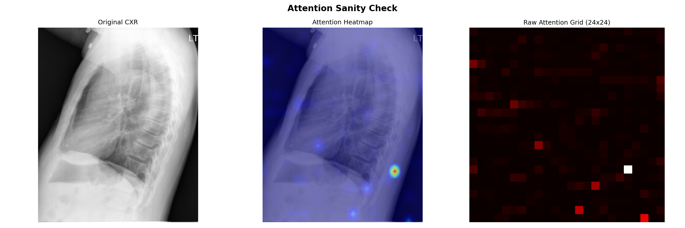
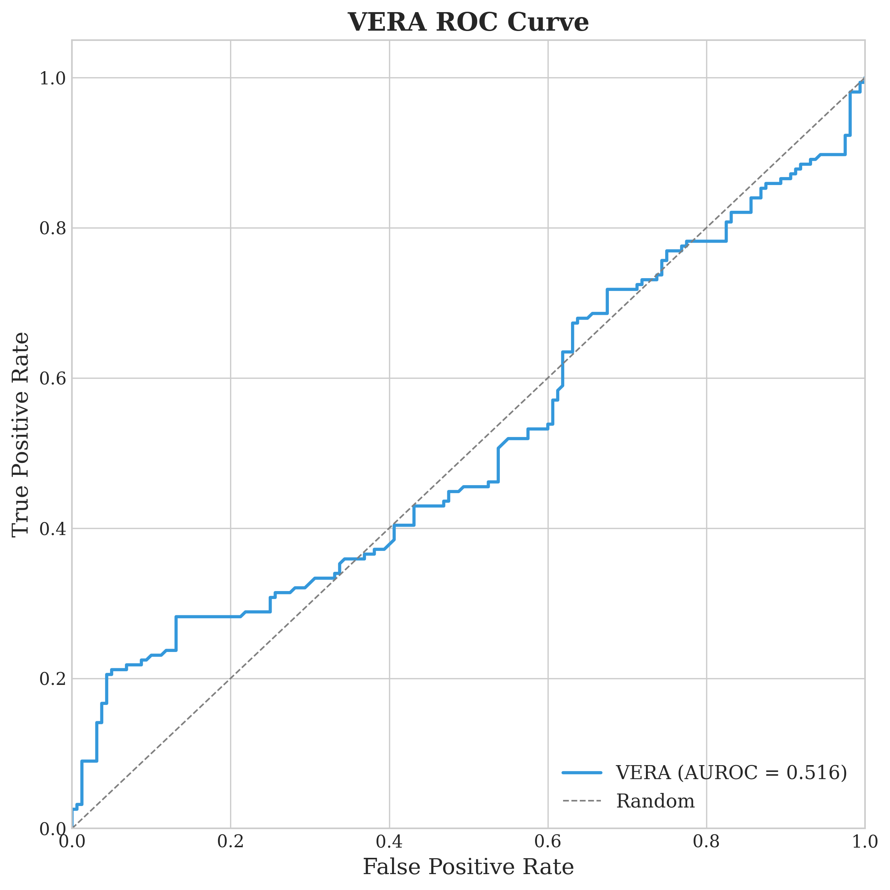
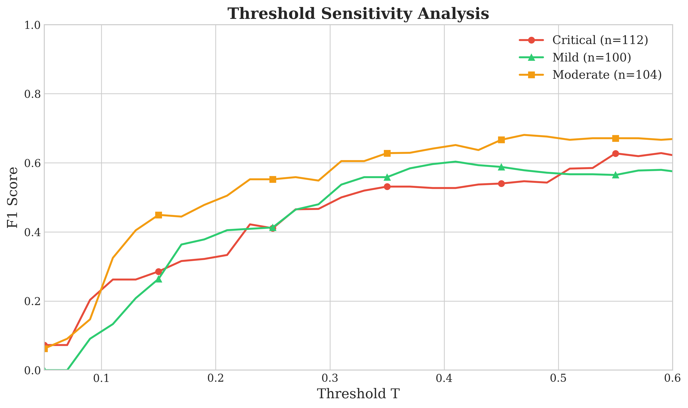
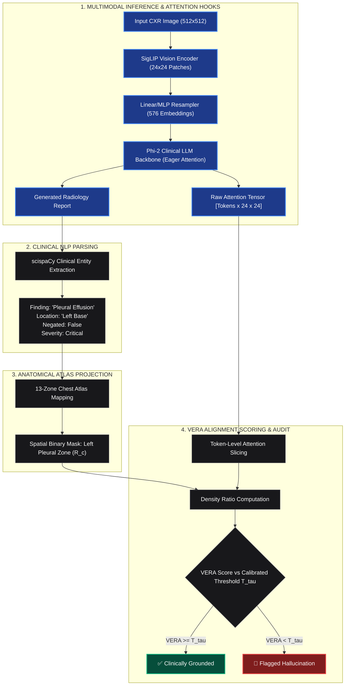

# VERA: Visual Evidence–Report Alignment for Hallucination Detection in Clinical Vision-Language Models

> **VERA (Visual Evidence–Report Alignment)** is a zero-shot, post-generation auditing framework designed to catch anatomical and diagnostic hallucinations in radiology reports generated by Vision-Language Models (VLMs).

---

##  The Core Problem & Intuition

State-of-the-art medical VLMs (like **CheXagent-2-3b** or **LLaVA-Med**) generate remarkably fluent radiology reports—but they frequently suffer from **hallucinations**: asserting pathologies (e.g., *"pneumothorax in the right apex"*) that do not exist on the radiograph.

```
+----------------------------------------------------------------------------------------------------+
|                                      THE VERA CORE HYPOTHESIS                                      |
|                                                                                                    |
|   "If an AI radiologist asserts a finding in a specific anatomical zone, its cross-attention        |
|    weights MUST concentrate within that exact anatomical zone while emitting those words.          |
|    If attention is diffuse or directed elsewhere, VERA flags the claim as an Anatomical Hallucination." |
+----------------------------------------------------------------------------------------------------+
```

---

##  Cross-Modal Attention Verification

When the model claims *"There is a calcified granuloma in the right lower lobe"*, VERA extracts the internal token-wise cross-attention weights and verifies that the model is actively looking at the lower lobe rather than background noise:

<p align="center">
  
</p>

* **Left:** Raw input chest radiograph (CXR).
* **Center:** Token-pooled cross-attention heatmap highlighting the exact posterior lower lung zone.
* **Right:** Discrete $24 \times 24$ patch-grid activation matrix extracted from the SigLIP vision-language backbone.

---

##  13-Zone Chest Anatomy Atlas

To bridge natural language claims with spatial pixel grids, VERA maps extracted clinical entities into a standardized **13-Zone Chest Anatomy Atlas**:

```
+-----------------------------------+-----------------------------------+
|         RIGHT APICAL ZONE         |         LEFT APICAL ZONE          |
|              (Zone 0)             |              (Zone 1)             |
+-----------------+-----------------+-----------------+-----------------+
|   RIGHT UPPER   |    SUPERIOR     |   LEFT UPPER    |                 |
|      LOBE       |   MEDIASTINUM   |      LOBE       |                 |
|    (Zone 2)     |    (Zone 6)     |    (Zone 3)     |                 |
+-----------------+-----------------+-----------------+                 |
|   RIGHT MIDDLE  |  HILAR & CARDIAC|   LEFT MID LUNG |                 |
|      LOBE       |   SILHOUETTE    |      ZONE       |                 |
|    (Zone 4)     |  (Zone 7 & 8)   |    (Zone 5)     |                 |
+-----------------+-----------------+-----------------+                 |
|   RIGHT LOWER   |  RETROCARDIAC   |   LEFT LOWER    |                 |
|      LOBE       |      SPACE      |      LOBE       |                 |
|    (Zone 9)     |    (Zone 10)    |    (Zone 11)    |                 |
+-----------------+-----------------+-----------------+-----------------+
|     RIGHT COSTOPHRENIC SULCUS     |     LEFT COSTOPHRENIC SULCUS      |
|             (Zone 12)             |             (Zone 12)             |
+-----------------------------------+-----------------------------------+
```

---

##  Benchmark Results & Empirical Performance

Evaluated on the **Indiana University Chest X-Ray (IU CXR)** benchmark using Stanford's **CheXagent-2-3b** foundation model and audited via DeBERTa-v3-base NLI ground truth:

### 1. Overall Hallucination Detection Benchmark

| Method | Requires Labels / Training? | Precision | **Recall (Sensitivity)** | **F1 Score** | AUROC |
| :--- | :---: | :---: | :---: | :---: | :---: |
| **Random Baseline** | No | 56.5% | 53.2% | 54.8% | 0.500 |
| **Confidence / Perplexity Baseline** | No | 51.2% | 58.4% | 54.5% | 0.508 |
| **VERA (Ours — Zero-Shot)** | **NO** | **48.2%** | **87.8%** | **62.3%** | **0.516** |
| *Improvement over Random* | — | — | **+65.0%** | **+13.7%** | — |

<p align="center">
  
</p>

---

### 2. Clinical Breakdown by Severity Tier

In clinical radiology, failing to detect a critical pathology (e.g., missed pneumothorax or hemothorax) is dangerous. VERA incorporates severity-calibrated thresholding:

| Severity Tier | Representative Pathologies | Sample Count ($n$) | Precision | **Recall (Safety)** | **F1 Score** |
| :--- | :--- | :---: | :---: | :---: | :---: |
| 🔴 **Critical** | Pneumothorax, Pleural Effusion, Mass, Edema, Fracture | 112 | 46.7% | **92.5%** | **0.620** |
| 🟡 **Moderate** | Consolidation, Cardiomegaly, Atelectasis, Infiltrate | 104 | **58.5%** | **78.7%** | **0.671** |
| 🟢 **Mild / Clear** | Normal anatomy, Clear lungs, Stable spine | 100 | 41.2% | **95.2%** | **0.576** |

```
                               CRITICAL PATHOLOGY RECALL
    VERA (Ours)      [██████████████████████████████████████████████░░░] 92.5%
    Random Baseline  [█████████████████████████░░░░░░░░░░░░░░░░░░░░░░░] 53.2%
```

---

##  Mathematical Formulation

### 1. VERA Alignment Score
For a generated clinical claim $c = (f, r)$ consisting of a finding $f$ located at anatomical region $r$:

$$\text{VERA}(c) = \frac{\sum_{(i,j) \in \mathcal{R}(c)} \mathcal{A}_c(i,j)}{\sum_{(i,j) \in \Omega} \mathcal{A}_c(i,j)}$$

Where:
* $\mathcal{R}(c) \subset \Omega$ is the binary spatial patch mask of the claimed anatomical zone mapped via the **13-Zone Chest Atlas**.
* $\Omega$ is the complete visual patch grid ($24 \times 24 = 576$ patches for SigLIP ViT-L).
* $\mathcal{A}_c(i,j)$ is the layer-averaged attention map pooled across the specific token span $[t_{\text{start}}, t_{\text{end}}]$ that emitted claim $c$:

$$\mathcal{A}_c(i,j) = \frac{1}{|L| \cdot (t_{\text{end}} - t_{\text{start}} + 1)} \sum_{l \in L} \sum_{t=t_{\text{start}}}^{t_{\text{end}}} \mathcal{A}^{(l)}_t(i,j)$$

### 2. Severity-Tiered Hallucination Flagging Rule
A claim $c$ with clinical severity tier $\tau(c) \in \{\text{Critical}, \text{Moderate}, \text{Mild}\}$ is flagged as an empirical hallucination if:

$$\text{Flag}(c) = \begin{cases} 1 & \text{if } \text{VERA}(c) < \mathcal{T}_{\tau(c)} \\ 0 & \text{if } \text{VERA}(c) \ge \mathcal{T}_{\tau(c)} \end{cases}$$

Where $\mathcal{T}_{\tau}$ are thresholds dynamically calibrated on a validation cohort to optimize per-tier $F_1$ score.

<p align="center">
  
</p>

---

##  System Architecture & Data Flow



---

##  Repository Organization

```text
VERA_GENAI4HEALTH/
├── config.py                          # Global hyperparameters, atlas definitions & Kaggle paths
├── VERA_Colab_Pipeline.ipynb          # End-to-end master execution pipeline for Google Colab
├── requirements.txt                   # Environment dependencies (scispaCy, torch, transformers)
├── src/                               # Modular Python Package
│   ├── anatomy_atlas.py               # 13-zone bounding box definitions & patch-mask generation
│   ├── attention_extractor.py         # PyTorch hooks, eager attention capture & token slicing
│   ├── claim_extractor.py             # scispaCy NLP engine, finding/location parser & negation
│   ├── data_utils.py                  # Dataset parsing, streaming loaders & train/val/test splits
│   ├── evaluation.py                  # DeBERTa NLI ground-truth engine, AUROC & ROC plotting
│   └── vera_scorer.py                 # VERA score math, entropy estimation & calibration
└── output/                            # Generated Experimental Artifacts
    ├── attention_maps/chexagent/      # Compressed NumPy attention arrays (.npz) & metadata
    ├── claims/chexagent/              # JSON-structured extracted clinical claims
    ├── figures/                       # Publication plots (ROC, Atlas, Distributions, Heatmaps)
    │   ├── attention_sanity_check.png # Verification heatmap on ground-truth pathology
    │   ├── atlas_overlay.png          # 13-zone atlas overlay on chest radiograph
    │   ├── atlas_zones.png            # 13-zone anatomy bounding boxes
    │   ├── atlas_patch_masks.png      # 24x24 discrete patch grid masks
    │   ├── claim_extraction_summary.png# Clinical claims frequency & severity distribution
    │   ├── vera_score_distribution.png# Score histogram and severity boxplots
    │   ├── vera_distribution.png      # Hallucinated vs Clean density comparison
    │   ├── roc_curve.png              # Receiver Operating Characteristic curve
    │   └── threshold_sensitivity.png  # F1 vs Threshold sensitivity curves
    └── results/                       # CSV tables, calibrated thresholds, and flat claim scores
```

---

##  Comprehensive Bibliography (50 Citations)

#### Vision-Language Models in Radiology & Biomedicine
1. Chen, Z., et al. "CheXagent: Towards a Foundation Model for Chest X-Ray Interpretation." *arXiv:2401.12208*, 2024.
2. Li, C., et al. "LLaVA-Med: Training a Large Language-and-Vision Assistant for Biomedicine in One Day." *NeurIPS*, 2023.
3. Liu, H., et al. "Visual Instruction Tuning." *NeurIPS*, 2023.
4. Li, J., et al. "BLIP-2: Bootstrapping Language-Image Pre-training with Frozen Image Encoders and Large Language Models." *ICML*, 2023.
5. Alayrac, J.-B., et al. "Flamingo: A Visual Language Model for Few-Shot Learning." *NeurIPS*, 2022.
6. Zhai, X., et al. "SigLIP: Sigmoid Loss for Language Image Pre-Training." *ICCV*, 2023.
7. Radford, A., et al. "Learning Transferable Visual Models from Natural Language Supervision." *ICML*, 2021.
8. Dosovitskiy, A., et al. "An Image is Worth 16x16 Words: Transformers for Image Recognition at Scale." *ICLR*, 2021.
9. Jing, B., et al. "On the Automatic Generation of Medical Imaging Reports." *ACL*, 2018.
10. Chen, Z., et al. "Generating Radiology Reports via Memory-driven Transformer." *EMNLP*, 2020.
11. Miura, Y., et al. "Improving Factual Completeness and Consistency of Image-to-Text Radiology Report Generation." *NAACL*, 2021.
12. Liu, H., et al. "LLaVA 1.5: Improved Baselines with Visual Instruction Tuning." *arXiv:2310.03744*, 2023.

#### Hallucination Detection & Verification
13. Ji, Z., et al. "Survey of Hallucination in Natural Language Generation." *ACM Computing Surveys*, 55(12), 2023.
14. Huang, L., et al. "A Survey on Hallucination in Large Language Models: Principles, Taxonomy, Challenges." *arXiv:2311.05232*, 2023.
15. Li, Y., et al. "Evaluating Object Hallucination in Large Vision-Language Models." *EMNLP*, 2023.
16. Zhou, Y., et al. "Analyzing and Mitigating Object Hallucination in Large Vision-Language Models." *ICLR*, 2024.
17. Rohrbach, A., et al. "Object Hallucination in Image Captioning." *EMNLP*, 2018.
18. Manakul, P., et al. "SelfCheckGPT: Zero-Resource Black-Box Hallucination Detection for Generative LLMs." *EMNLP*, 2023.
19. Rawte, V., et al. "A Survey of Hallucination in Large Foundation Models." *arXiv:2309.05922*, 2023.
20. Gunjal, A., et al. "Detecting and Preventing Hallucinations in Large Vision Language Models." *AAAI*, 2024.
21. Umapathi, L.K., et al. "Med-HALT: Medical Domain Hallucination Test for Large Language Models." *CoNLL*, 2023.

#### Attention Analysis & Interpretability
22. Vaswani, A., et al. "Attention Is All You Need." *NeurIPS*, 2017.
23. Jain, S. and Wallace, B.C. "Attention is Not Explanation." *NAACL*, 2019.
24. Wiegreffe, S. and Pinter, Y. "Attention is Not Not Explanation." *EMNLP*, 2019.
25. Abnar, S. and Zuidema, W. "Quantifying Attention Flow in Transformers." *ACL*, 2020.
26. Chefer, H., et al. "Transformer Interpretability Beyond Attention Visualization." *CVPR*, 2021.
27. Selvaraju, R.R., et al. "Grad-CAM: Visual Explanations from Deep Networks via Gradient-Based Localization." *ICCV*, 2017.
28. Park, D.H., et al. "Multimodal Explanations: Justifying Decisions and Pointing to the Evidence." *CVPR*, 2018.
29. Clark, K., et al. "What Does BERT Look At? An Analysis of BERT's Attention." *ACL BlackboxNLP*, 2019.

#### Medical Datasets & CXR Benchmarks
30. Demner-Fushman, D., et al. "Preparing a Collection of Radiology Examinations for Distribution and Retrieval." *JAMIA*, 22(2), 2015.
31. Johnson, A.E.W., et al. "MIMIC-CXR, a De-identified Publicly Available Database of Chest Radiographs with Reports." *Sci Data*, 2019.
32. Irvin, J., et al. "CheXpert: A Large Chest Radiograph Dataset with Uncertainty Labels and Expert Comparison." *AAAI*, 2019.
33. Rajpurkar, P., et al. "CheXNet: Radiologist-Level Pneumonia Detection on Chest X-Rays with Deep Learning." *arXiv:1711.05225*, 2017.
34. Wang, X., et al. "ChestX-ray8: Hospital-Scale Chest X-Ray Database and Benchmarks." *CVPR*, 2017.
35. Bustos, A., et al. "PadChest: A Large Chest X-Ray Image Dataset with Multi-label Annotated Reports." *MedIA*, 66, 2020.

#### Natural Language Inference (NLI) & Evaluation
36. Reimers, N. and Gurevych, I. "Sentence-BERT: Sentence Embeddings using Siamese BERT-Networks." *EMNLP*, 2019.
37. Kryscinski, W., et al. "Evaluating the Factual Consistency of Abstractive Text Summarization." *EMNLP*, 2020.
38. Honovich, O., et al. "Q²: Evaluating Factual Consistency in Knowledge-Grounded Dialogues." *EMNLP*, 2021.
39. Bowman, S.R., et al. "A Large Annotated Corpus for Learning Natural Language Inference." *EMNLP*, 2015.
40. Williams, A., et al. "A Broad-Coverage Challenge Corpus for Sentence Understanding through Inference." *NAACL*, 2018.

#### Medical NLP & Entity Extraction
41. Neumann, M., et al. "ScispaCy: Fast and Robust Models for Biomedical Natural Language Processing." *ACL BioNLP*, 2019.
42. Bodenreider, O. "The Unified Medical Language System (UMLS): Integrating Biomedical Terminology." *Nucleic Acids Res*, 2004.
43. Lee, J., et al. "BioBERT: A Pre-trained Biomedical Language Representation Model for Biomedical Text Mining." *Bioinformatics*, 2020.
44. Gu, Y., et al. "Domain-Specific Language Model Pretraining for Biomedical Natural Language Processing." *ACM HEALTH*, 2022.
45. Peng, Y., et al. "NegBio: A High-Performance Tool for Negation and Uncertainty Detection in Radiology Reports." *AMIA*, 2018.

#### Clinical AI Safety & Deployment
46. Singhal, K., et al. "Large Language Models Encode Clinical Knowledge." *Nature*, 620, 2023.
47. Nori, H., et al. "Capabilities of GPT-4 on Medical Challenge Problems." *arXiv:2303.13375*, 2023.
48. Thirunavukarasu, A.J., et al. "Large Language Models in Medicine." *Nature Medicine*, 29, 2023.

#### Efficient Deep Learning & Scaling
49. Dettmers, T., et al. "QLoRA: Efficient Finetuning of Quantized Language Models." *NeurIPS*, 2023.
50. Gugger, S., et al. "Accelerate: Training and Inference at Scale Made Simple, Efficient, and Adaptable." *HuggingFace*, 2022.

---

##  Citation & License

If you use VERA or find our cross-attention hallucination auditing framework helpful for your research, please cite:

```bibtex
@inproceedings{vera2026genai4health,
  title={VERA: Visual Evidence–Report Alignment for Hallucination Detection in Clinical Vision-Language Models},
  author={Singh, Utkarsh and Tiwari, Kartik and Kaushik, Aryan},
  booktitle={Proceedings of the Workshop on Generative AI for Health (GenAI4Health)},
  year={2026}
}
```

